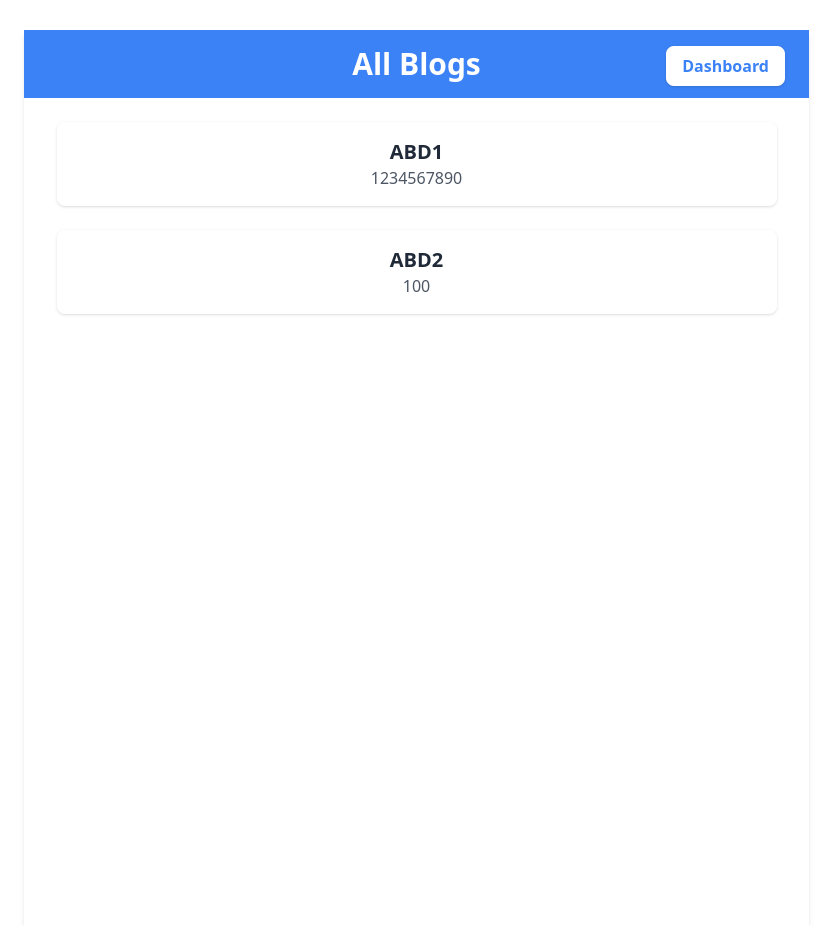

# Blog Site 

[!NOTE]
``` 
git clone https://github.com/bharani2624/Blog_Site
cd Blog_Site
npm i vite
cd backend
npm install express mysql cors body-parser bcrypt jsonwebtoken
or
npm i (run this alone)
cd ..
cd blog
npm install -D tailwindcss postcss autoprefixer
npm install axios react-router-dom

or 

npm i (run this alone)

npm run dev
cd ..
cd backend
npm start


Kindly Import The Tables To Your SQL
```
## Images

### LOGIN


### REGISTER


### HOME


### DASHBOARD

